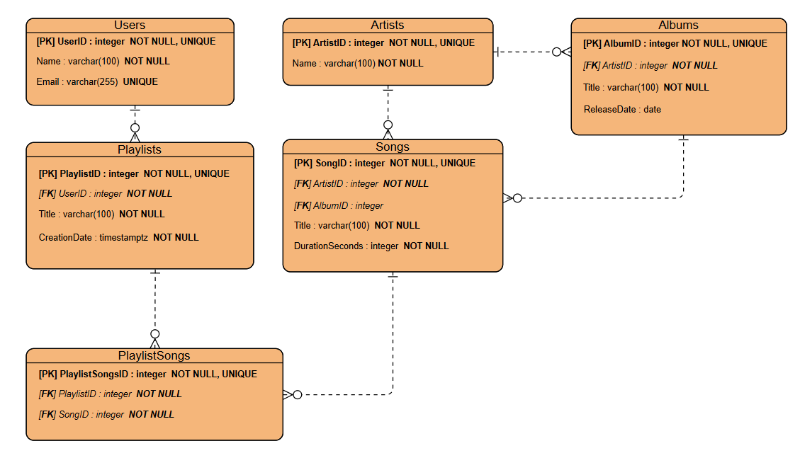

# Part 1: Выбор Сценария #

Для данной работы выбран сценарий: **Сервис Потоковой Музыки**. Эта система будет управлять артистами, альбомами, песнями, пользователями и плейлистами.

# Part 2: Проектирование Базы Данных и Документация #

### Идентификация Сущностей и Атрибутов: ###
1. __Артисты (Artists)__
2. __Альбомы (Albums)__
3. __Песни (Songs)__
4. __Пользователи (Users)__
5. __Плейлисты (Playlists)__
6. __Песни плейлиста (PlaylistSongs):__ (Для отслеживания, какие песни содержатся в плейлисте)

### Проектирование Таблиц: ###

1\. __Table Name: Artists__
  * **Description**: Хранит информацию об артистах.
  * **Attributes**:
      - *ArtistID*: INTEGER, PK, NOT NULL, UNIQUE
      - *Name*: VARCHAR(100), NOT NULL
  * **Constraints**:
      - *PK_Artists*: PRIMARY KEY ( ArtistID )

2\. __Table Name: Albums__
  * **Description**: Хранит информацию об альбомах.
  * **Attributes**:
      - *AlbumID*: INTEGER, PK, NOT NULL, UNIQUE
      - *ArtistID*: INTEGER, FK (REFERENCES Artists), NOT NULL
      - *Title*: VARCHAR(100), NOT NULL
      - *ReleaseDate*: DATE
  * **Constraints**:
      - *PK_Albums*: PRIMARY KEY ( AlbumID )
      - *FK_Albums_Artists*: FOREIGN KEY ( ArtistID ) REFERENCES Artists ( ArtistID )

3\. __Table Name: Songs__
  * **Description**: Хранит информацию о песнях.
  * **Attributes**:
      - *SongID*: INTEGER, PK, NOT NULL, UNIQUE
      - *ArtistID*: INTEGER, FK (REFERENCES Artists), NOT NULL
      - *AlbumID*: INTEGER, FK (REFERENCES Albums)
      - *Title*: VARCHAR(100), NOT NULL
      - *DurationSeconds*: INTEGER, NOT NULL
  * **Constraints**:
      - *PK_Songs*: PRIMARY KEY ( SongID )
      - *FK_Songs_Artists*: FOREIGN KEY ( ArtistID ) REFERENCES Artists ( ArtistID )
      - *FK_Songs_Albums*: FOREIGN KEY ( AlbumID ) REFERENCES Albums ( AlbumID )
      - *CHK_DurationSeconds*: CHECK (DurationSeconds >= 0)

4\. __Table Name: Users__
  * **Description**: Хранит информацию о пользователях.
  * **Attributes**:
      - *UserID*: INTEGER, PK, NOT NULL, UNIQUE
      - *Name*: VARCHAR(100), NOT NULL
      - *Email*: VARCHAR(255), UNIQUE
  * **Constraints**:
      - *PK_Users*: PRIMARY KEY ( UserID )
      - *UQ_Email*: UNIQUE ( Email )

5\. __Table Name: Playlists__
  * **Description**: Хранит информацию о плейлистах.
  * **Attributes**:
      - *PlaylistID*: INTEGER, PK, NOT NULL, UNIQUE
      - *UserID*: INTEGER, FK (REFERENCES Users), NOT NULL
      - *Title*: VARCHAR(100), NOT NULL
      - *CreationDate*: TIMESTAMPTZ, NOT NULL
  * **Constraints**:
      - *PK_Playlists*: PRIMARY KEY ( PlaylistID )
      - *FK_Playlists_Users*: FOREIGN KEY ( UserID ) REFERENCES Users ( UserID )

6\. __Table Name: PlaylistSongs__
  * **Description**: Хранит информацию о песнях плейлиста.
  * **Attributes**:
      - *PlaylistSongsID*: INTEGER, PK, NOT NULL, UNIQUE
      - *PlaylistID*: INTEGER, FK (REFERENCES Playlists), NOT NULL
      - *SongID*: INTEGER, FK (REFERENCES Songs), NOT NULL
  * **Constraints**:
      - *PK_PlaylistSongs*: PRIMARY KEY ( PlaylistSongsID )
      - *FK_PlaylistSongs_Playlists*: FOREIGN KEY ( PlaylistID ) REFERENCES Playlists ( PlaylistID ) 
      - *FK_PlaylistSongs_Songs*: FOREIGN KEY ( SongID ) REFERENCES Songs ( SongID )

### Взаимосвязи: ###

* __Artists и Albums (Один-ко-Многим)__: У одного артиста может быть несколько альбомов, но каждый альбом имеет одного основного артиста.
  - Albums.ArtistID является внешним ключом, ссылающимся на Artists.ArtistID.

* __Albums и Songs (Один-ко-Многим)__: В одном альбоме может быть несколько песен, но каждая песня содержится только в одном альбоме.
  - Songs.AlbumID является внешним ключом, ссылающимся на Albums.AlbumID.

* __Artists и Songs (Один-ко-Многим)__: У одного артиста может быть несколько песен, но каждая песня имеет одного основного артиста.
  - Songs.ArtistID является внешним ключом, ссылающимся на Artists.ArtistID.

* __Users и Playlists (Один-ко-Многим)__: У одного пользователя может быть несколько плейлистов, но каждый плейлист имеет одного пользователя-создателя.
  - Playlists.UserID является внешним ключом, ссылающимся на Users.UserID.

* __Playlists и PlaylistSongs (Один-ко-Многим)__: В одном плейлисте может быть много песен, но каждая запись в списке песен в плейлисте относится к одному конкретному плейлисту. 
  - PlaylistSongs.PlaylistID является внешним ключом, ссылающимся на Playlists.PlaylistID.

* __Songs и PlaylistSongs (Один-ко-Многим)__: Одна песня может содержаться в нескольких пользовательских плейлистах, но каждая запись в списке песен в плейлисте относится к одной конкретной песне.
  - PlaylistSongs.SongID является внешним ключом, ссылающимся на Songs.SongID.

# Part 3: ER-Диаграмма #

