# Задание 1: Приветствие #

__Описание__: _Напишите программу, которая сначала спрашивает у пользователя его имя,_
_а затем выводит персональное приветствие, используя это имя._

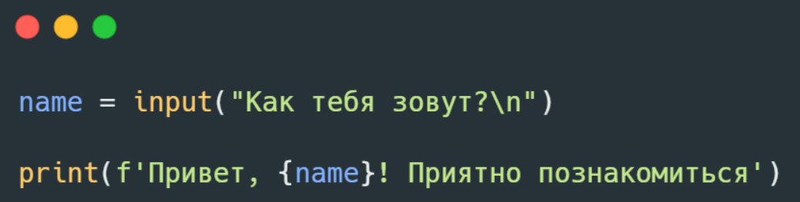

### Пример вывода ###

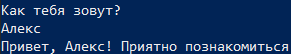

# Задание 2: Площадь прямоугольника #

__Описание__: _Напишите программу, которая запрашивает у пользователя длину и ширину прямоугольника._
_После получения данных  программа должна вычислить и вывести на экран площадь этого прямоугольника._

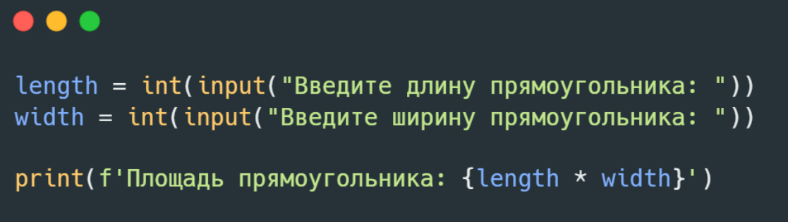

### Пример вывода ###

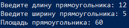

# Задание 3: Конвертер температур #

__Описание__: _Напишите программу, которая запрашивает у пользователя температуру в градусах Цельсия,_
_переводит её в градусы Фаренгейта и выводит результат на экран._

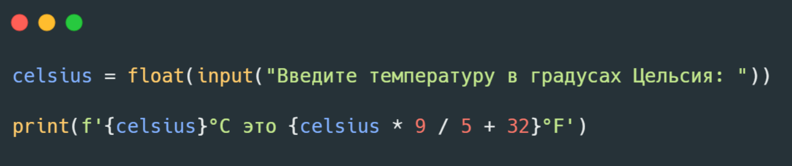

### Пример вывода ###

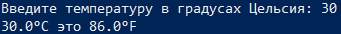

# Задание 4: Проверка числа на чётность #

__Описание__: _Напишите программу, которая запрашивает у пользователя целое число_
_и определяет, является ли оно чётным или нечётным._

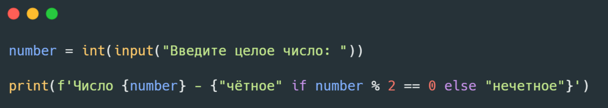

### Пример вывода ###

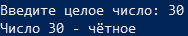

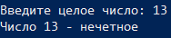

# Задание 5: Игра «Угадай число» #

__Описание__: _Напишите программу, которая генерирует случайное число от 1 до 20._
_У пользователя есть 5 попыток, чтобы его угадать._
_На каждом шаге программа подсказывает («Слишком много!» или «Слишком мало!») и сообщает, сколько попыток осталось._
_Игра завершается, если число угадано или закончились попытки._

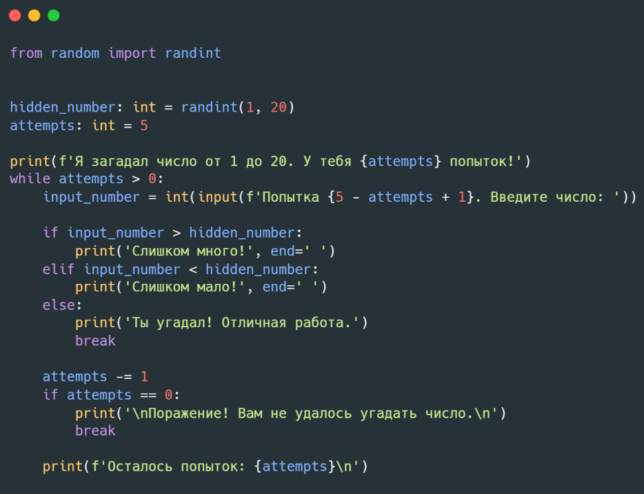

### Пример вывода ###

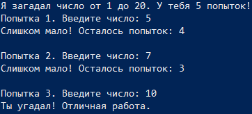

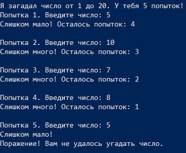

# Задание 6: Калькулятор #

__Описание__: _Напишите программу, которая работает как простой калькулятор._
_Программа должна запросить у пользователя два числа и символ операции (+, -, *, /),_
_а затем выполнить расчёт и вывести результат._

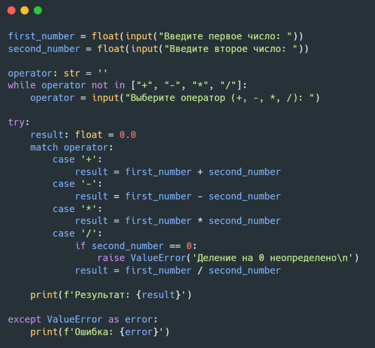

### Пример вывода ###

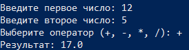

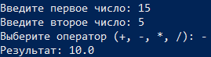

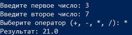

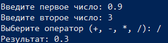

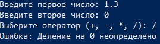
