## Задание 1 ##

1\. *Вставить двух новых сотрудников в таблицу Employees (с любыми отделами, кроме 'IT').*

2\. *Выбрать всех сотрудников из таблицы Employees.*

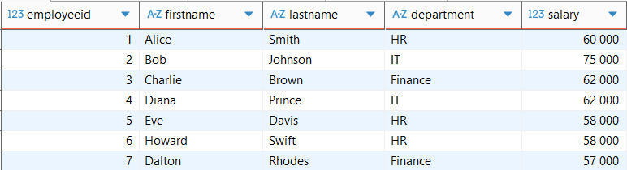

3\. *Выбрать только FirstName и LastName сотрудников из отдела 'IT'.*

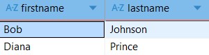

4\. *Обновить Salary 'Alice Smith' до 65000.00.*

5\. *Удалить сотрудника 'Eve Davis'.*

6\. *Проверить все изменения, используя SELECT * FROM Employees;*

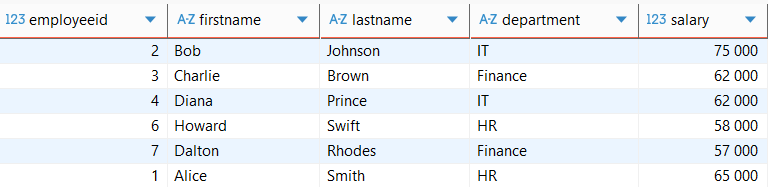

### Скрипт ###
```sql
INSERT INTO Employees
(FirstName, LastName,  Department, Salary)
VALUES
('Howard',   'Swift',  'HR',       58000.00),
('Dalton',   'Rhodes', 'Finance',  57000.00);


SELECT * FROM Employees;


SELECT FirstName, LastName
FROM Employees
WHERE Department = 'IT';


UPDATE Employees
SET Salary = 65000.00
WHERE EmployeeID = 1;


DELETE FROM Employees
WHERE EmployeeID = 5;


SELECT * FROM Employees;
```


## Задание 2 ##
1\. *Создать новую таблицу с именем Departments со столбцами: DepartmentID (SERIAL PRIMARY KEY), DepartmentName (VARCHAR(50), UNIQUE, NOT NULL), Location (VARCHAR(50)).*

2\. *Изменить таблицу Employees, добавив новый столбец с именем Email (VARCHAR(100)).*

3\. *Заполнить столбец Email для всех текущих сотрудников уникальными значениями (например, через UPDATE).*

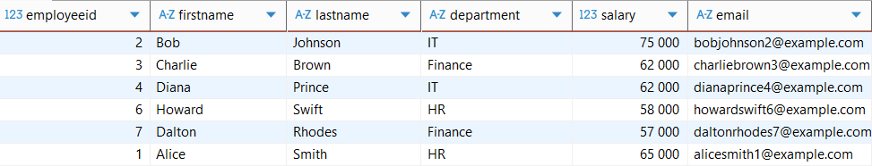

4\. *Добавить ограничение UNIQUE к столбцу Email в таблице Employees.*

5\. *Переименовать столбец Location в таблице Departments в OfficeLocation.*

### Скрипт ###
```sql
-- Table 'Departments'
CREATE TABLE Departments (
    DepartmentID SERIAL PRIMARY KEY,
    DepartmentName VARCHAR(50) UNIQUE NOT NULL,
    Location VARCHAR(50)
);


ALTER TABLE Employees
ADD Email VARCHAR(100);


UPDATE Employees
SET Email = CONCAT(lower(FirstName), lower(LastName), EmployeeID, '@example.com');


ALTER TABLE Employees
ADD UNIQUE (Email);


SELECT * FROM Employees;


ALTER TABLE Departments
RENAME COLUMN Location TO OfficeLocation;
```


## Задание 3 ##
1\. *Создать нового пользователя PostgreSQL (роль) с именем hr_user и паролем.*

2\. *Предоставить hr_user право SELECT на таблицу Employees.*

3\.
* __Тест 1__: *В новой сессии подключиться как hr_user и попытаться выполнить SELECT * FROM Employees; (Должно сработать).*
* __Тест 2__: *Под hr_user попытаться выполнить INSERT нового сотрудника (должна возникнуть ошибка доступа).*

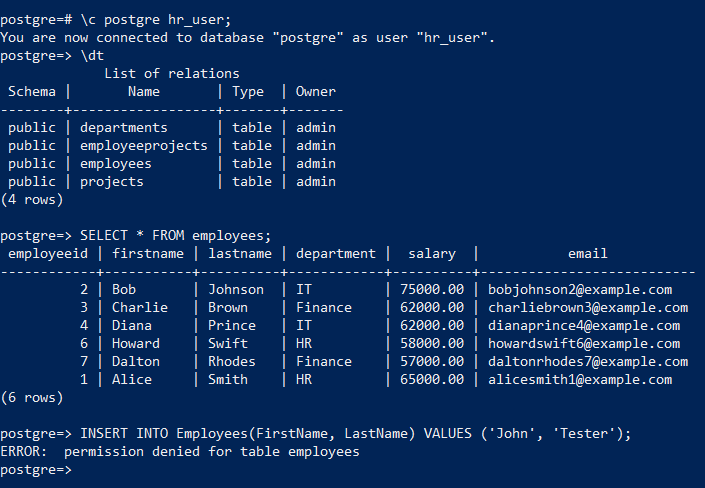

4\. *Как пользователь-администратор, предоставить hr_user права INSERT и UPDATE на таблицу Employees.*

5\. __Тест 3__: *Как hr_user, попробовать выполнить INSERT и UPDATE сотрудника. (Теперь должно сработать).*

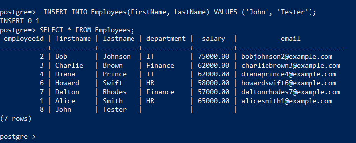


### Скрипт ###
```sql
CREATE USER hr_user WITH LOGIN PASSWORD 'pass';


GRANT USAGE ON SCHEMA public TO hr_user;


GRANT SELECT
ON Employees
TO hr_user;


GRANT USAGE, SELECT
ON SEQUENCE employees_employeeid_seq
TO hr_user;


GRANT INSERT, UPDATE
ON Employees
TO hr_user;
```


## Задание 4 ##
1\. _Увеличить Salary всех сотрудников в отделе 'HR' на 10%._

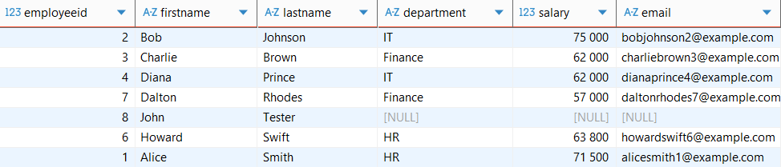

2\. _Обновить Department любого сотрудника с Salary выше 70000.00 на 'Senior IT'._

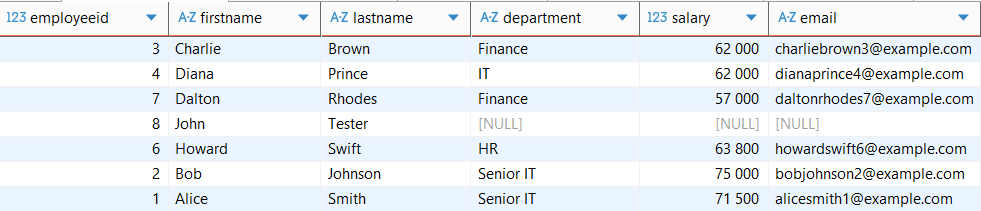

3\. _Удалить всех сотрудников, которые не назначены ни на один проект в таблице EmployeeProjects. Подсказка: Используйте подзапрос NOT EXISTS или LEFT JOIN_

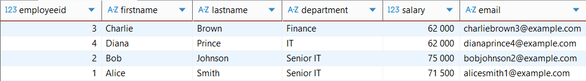

4\. _В рамках одной транзакции, вставить новый проект и назначить на него двух существующих сотрудников с определенным количеством HoursWorked в EmployeeProjects._

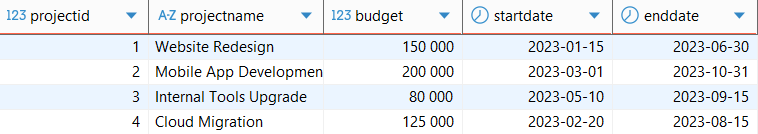

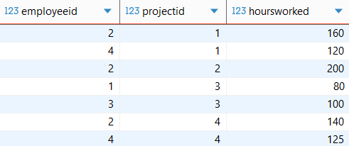


### Скрипт ###
```sql
UPDATE Employees
SET Salary = Salary * 1.1
WHERE Department = 'HR';


SELECT * FROM Employees;


UPDATE Employees
SET Department = 'Senior IT'
WHERE Salary > 70000.00;


SELECT * FROM Employees;


DELETE FROM Employees AS e
WHERE NOT EXISTS (
    SELECT 1
    FROM EmployeeProjects AS ep
    WHERE ep.EmployeeID = e.EmployeeID
);


SELECT * FROM Employees;


BEGIN;

INSERT INTO Projects
(ProjectName,           Budget,     StartDate,     EndDate     )
VALUES
('Cloud Migration',     125000.00,  '2023-02-20',  '2023-08-15');

INSERT INTO EmployeeProjects
(EmployeeID, ProjectID,  HoursWorked)
VALUES
(2,          4,          140        ),
(4,          4,          125        );

COMMIT;


SELECT * FROM Projects;

SELECT * FROM EmployeeProjects;
```


## Задание 5 ##
1\. ***Функция**: Создать функцию PostgreSQL с именем CalculateAnnualBonus, которая принимает employee_id и Salary  в качестве входных данных и возвращает рассчитанную сумму бонуса (10 % от Salary) для этого сотрудника. Используйте PL/pgSQL для тела функции.*

2\. *Использовать эту функцию в операторе SELECT, чтобы увидеть потенциальный бонус для каждого сотрудника.*

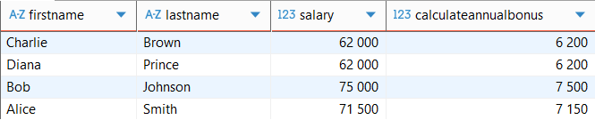

3\. ***Представление (View)**: Создать представление с именем IT_Department_View, которое показывает EmployeeID, FirstName, LastName и Salary только для сотрудников из отдела 'IT'.*

4\. *Выбрать данные из вашего представления IT_Department_View.*

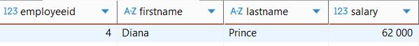


### Скрипт ###
```sql
CREATE FUNCTION CalculateAnnualBonus(EmployeeID INT, Salary DECIMAL)
RETURNS DECIMAL
LANGUAGE plpgsql
AS $$
BEGIN
    RETURN Salary * 0.1;
END;
$$;


SELECT FirstName, LastName, Salary, CalculateAnnualBonus(EmployeeID, Salary)
FROM Employees;


CREATE VIEW IT_Department_View AS
SELECT EmployeeID, FirstName, LastName, Salary
FROM Employees
WHERE Department = 'IT';


SELECT * FROM IT_Department_View;
```


## Задание 6 ##
1\. _Найти ProjectName всех проектов, в которых 'Bob Johnson' работал более 150 часов._


2\. _Увеличить Budget всех проектов на 10%, если к ним назначен хотя бы один сотрудник из отдела 'IT'._

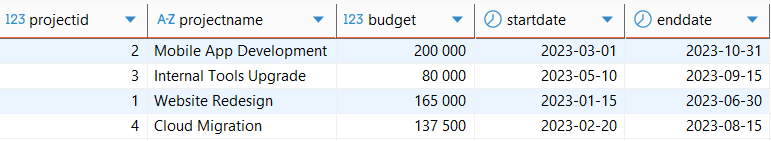

3\. _Для любого проекта, у которого еще нет EndDate (EndDate IS NULL), установить EndDate на один год позже его StartDate._

<small>Поскольку не было создано ни одного проекта без EndDate, то отдельно заменим EndDate для последнего созданного проекта и установим его запросом.</small>

```sql
UPDATE Projects
SET EndDate = NULL
WHERE ProjectID = 4;
```

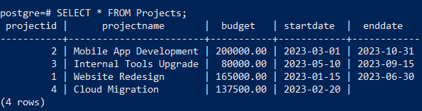

И выполним запрос

```sql
UPDATE Projects
SET EndDate = StartDate + Interval '1 year'
WHERE EndDate IS NULL;


SELECT * FROM Projects;
```

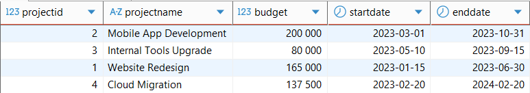


4\. _Вставить нового сотрудника и немедленно назначить его на проект 'Website Redesign' с 80 отработанными часами, все в рамках одной транзакции. Использовать предложение RETURNING, чтобы получить EmployeeID вновь вставленного сотрудника._

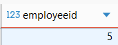

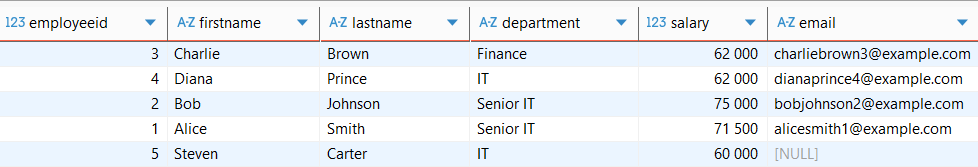

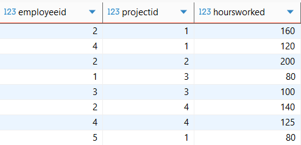


### Скрипт ###
```sql
SELECT ProjectName
FROM Projects AS p
WHERE EXISTS (
    SELECT 1
    FROM EmployeeProjects AS ep
    JOIN Employees AS e ON e.EmployeeID = ep.EmployeeID
    WHERE p.ProjectID = ep.ProjectID AND CONCAT(e.FirstName, ' ', e.LastName) = 'Bob Johnson' AND ep.HoursWorked > 150
);


UPDATE Projects AS p
SET Budget = Budget * 1.1
WHERE EXISTS (
    SELECT 1
    FROM EmployeeProjects AS ep
    JOIN Employees AS e ON e.EmployeeID = ep.EmployeeID
    WHERE p.ProjectID = ep.ProjectID AND e.Department = 'IT'
);


SELECT * FROM Projects;


UPDATE Projects
SET EndDate = StartDate + Interval '1 year'
WHERE EndDate IS NULL;


SELECT * FROM Projects;


BEGIN;

WITH new_employee AS (
    INSERT INTO Employees
    (FirstName, LastName,  Department, Salary)
    VALUES
    ('Steven',  'Carter',  'IT',       60000.00)
    RETURNING id;
)

INSERT INTO EmployeeProjects
(EmployeeID, ProjectID,  HoursWorked)
SELECT id,   1,          80
FROM new_employee;

COMMIT;


SELECT * FROM Employees;


SELECT * FROM EmployeeProjects;
```